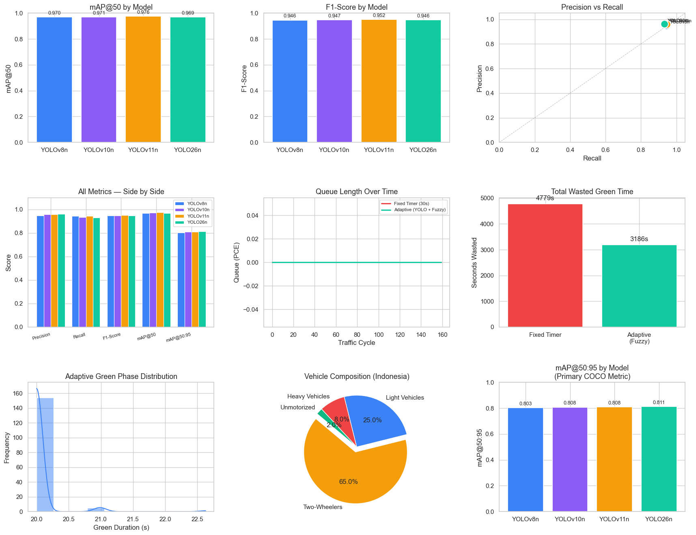

# Adaptive Traffic Signal Optimization Using YOLOv26 Object Detection and PCE-Weighted Fuzzy Logic

## 📂 Project Files

* 📄 [Article](Article.pdf)
* 📊 [Presentation (PPT)](Adaptive-Traffic-Signal-Optimization-Using-YOLOv26-Object-Detection-and-PCE-Weighted-Fuzzy-Logic%20%281%29.pptx.pptx)
* 💻 [Python Code](Pythoncode.ipynb)

---
## 📑 Table of Contents

1. [Title](#1-title)
2. [Executive Summary](#2-executive-summary)
3. [Business Problem](#3-business-problem)
4. [Methodology](#4-methodology)
5. [Skills](#5-Skills)
6. [Results & Business Recommendation](#6-results--business-recommendation)

   * [Graphs](#graphs)
   * [YOLO Model Comparison](#yolo-model-comparison)
   * [Traffic Signal Efficiency](#traffic-signal-efficiency)
   * [Edge Deployment Performance](#edge-deployment-performance)
   * [Business Recommendation](#business-recommendation)
7. [Next Steps](#7-next-steps)

---

## 1. Title

**Adaptive Traffic Signal Optimization Using YOLOv26 Object Detection and PCE-Weighted Fuzzy Logic**

This project develops an adaptive traffic light system that combines YOLOv26 object detection with PCE-weighted fuzzy logic to dynamically determine green-light duration based on real-time traffic conditions.

The system is designed for heterogeneous traffic conditions in Indonesia, where different types of vehicles such as motorcycles, cars, trucks, buses, and pickups have different effects on traffic flow.

---

## 2. Executive Summary

Traditional traffic lights commonly use fixed-time signal durations. This means that a lane can receive a green light for a predetermined amount of time regardless of the actual number of vehicles waiting.

This project proposes an adaptive traffic light system that uses YOLOv26 to detect vehicles and PCE-weighted fuzzy logic to determine an appropriate green-light duration.

The system uses an Indonesian vehicle dataset containing five vehicle classes: pickup, bus, car, motorcycle, and truck. Four YOLO models were compared: YOLOv8n, YOLOv10n, YOLOv11n, and YOLOv26n.

The reported results show that YOLOv26n achieved a precision of **0.9614** and mAP@0.50:0.95 of **0.8113**. The adaptive fuzzy approach reduced wasted green-light time from **4,781 seconds to 3,188 seconds**, representing a reported **33.3% reduction** compared with the fixed-time baseline.

The project demonstrates how computer vision, machine learning, vehicle tracking, PCE, and fuzzy logic can be combined to create an adaptive traffic signal system.

---

## 3. Business Problem

Traditional traffic lights often operate using fixed-time signal durations. These systems do not respond directly to changes in real-time traffic density.

For example, a traffic lane may continue receiving a green light even when there are few vehicles waiting, while another lane may have a larger queue.

This can result in:

* Wasted green-light time
* Longer vehicle waiting times
* Inefficient use of road capacity
* Increased fuel consumption
* Increased vehicle emissions
* Limited ability to respond to changing traffic conditions

The main problem addressed by this project is:

**How can traffic signals dynamically adjust their green-light duration according to real-time traffic conditions?**

The proposed solution uses real-time vehicle detection to estimate traffic density and fuzzy logic to determine the appropriate green-light duration.

---

## 4. Methodology

The project follows this overall process:

**Indonesian Vehicle Dataset → EDA → Data Preprocessing → YOLO Model Training → Vehicle Detection → Vehicle Tracking → PCE Calculation → Fuzzy Logic → Adaptive Green-Light Duration → Performance Evaluation**

### Dataset

The project uses an open-source Indonesian vehicle dataset from Roboflow.

The dataset contains:

* More than 10,500 images
* 5 vehicle classes
* Pickup
* Bus
* Car
* Motorcycle
* Truck
* High-definition images
* JPEG/JPG format

The dataset contains different vehicle types to represent heterogeneous traffic conditions.

### Exploratory Data Analysis

Exploratory Data Analysis (EDA) was conducted to understand the distribution and characteristics of the vehicle dataset.

The reported validation dataset has a relatively balanced distribution across the five vehicle categories, with each category containing more than 2,000 instances.

This dataset structure helps reduce the potential effect of class imbalance during YOLO model training.

### Data Preprocessing

The YOLO framework performs several preprocessing operations during the training process.

These include:

* Checking the dataset directory structure
* Verifying bounding-box coordinates
* Removing corrupt files
* Resizing images
* Letterbox padding
* Converting images into tensors
* Data augmentation

The training process also uses transformations such as mosaic stitching, horizontal flipping, and color modifications.

### YOLO Model Training

Four YOLO models were compared:

* YOLOv8n
* YOLOv10n
* YOLOv11n
* YOLOv26n

The models were evaluated using:

* Precision
* Recall
* F1-score
* mAP@0.50
* mAP@0.50:0.95

YOLOv26 Nano was used in the proposed adaptive traffic-light pipeline.

### Vehicle Detection and Tracking

The trained YOLO model detects vehicles from traffic video.

Vehicle tracking is then used to maintain the identity of detected vehicles across different video frames. This helps prevent the same vehicle from being repeatedly counted.

The detected vehicles within the relevant traffic area are then used to estimate traffic density.

### Passenger Car Equivalent (PCE)

Passenger Car Equivalent (PCE) is used because different vehicle types have different effects on traffic flow.

The research uses the following PCE values:

| Vehicle Type  |  PCE |
| ------------- | ---: |
| Light Vehicle |  1.0 |
| Heavy Vehicle |  1.3 |
| Motorcycle    | 0.25 |

The detected vehicles are converted into PCE values to estimate the overall traffic density.

### Fuzzy Logic Controller

The PCE-based traffic density is passed to a fuzzy logic controller.

The controller consists of:

1. **Fuzzification** – converts traffic density into fuzzy categories.
2. **Inference / Rule Evaluation** – applies predefined rules to the traffic condition.
3. **Defuzzification** – converts the fuzzy result into a specific green-light duration.

Traffic density can be represented using categories such as:

* Low
* Medium
* High

The resulting green-light duration is adjusted according to the detected traffic demand.

---

## 5. Skills

### 🐍 Programming & Data Analysis

### 🤖 Machine Learning & Computer Vision

### 🧠 Intelligent Systems

### 💻 Tools & Libraries

---

## 6. Results & Business Recommendation

## Graphs 

### YOLO Model Comparison

The reported model comparison produced the following results:

| Metric        | YOLOv26n | YOLOv8n | YOLOv10n | YOLOv11n |
| ------------- | -------: | ------: | -------: | -------: |
| Precision     |   0.9614 |  0.9477 |   0.9586 |   0.9582 |
| Recall        |   0.9317 |  0.9442 |   0.9350 |   0.9453 |
| F1-Score      |   0.9463 |  0.9459 |   0.9467 |   0.9517 |
| mAP@0.50      |   0.9693 |  0.9698 |   0.9705 |   0.9755 |
| mAP@0.50:0.95 |   0.8113 |  0.8033 |   0.8079 |   0.8081 |

YOLOv26n achieved a precision of **0.9614** and mAP@0.50:0.95 of **0.8113**.

YOLOv11n achieved a recall of **0.9453** and F1-score of **0.9517**.

These results show that the models have different performance characteristics across the evaluation metrics.

### Traffic Signal Efficiency

The adaptive fuzzy approach was compared with the fixed-time baseline:

| Approach       | Wasted Green Time |
| -------------- | ----------------: |
| Fixed Timer    |     4,781 seconds |
| Adaptive Fuzzy |     3,188 seconds |

The research reports a **33.3% reduction in wasted green-light time** using the adaptive approach.

The adaptive system also generated different green-light durations according to traffic demand. The reported distribution showed a high concentration around **20–21 seconds**.

### Edge Deployment Performance

The reported inference latency was:

| Model        | Latency |
| ------------ | ------: |
| YOLOv26      |  3.2 ms |
| YOLOv8n      |  8.5 ms |
| Faster R-CNN | 45.0 ms |

The reported inference throughput on a Tesla T4 GPU was:

| Model    |   FPS |
| -------- | ----: |
| YOLOv8n  | 115.5 |
| YOLOv10n | 101.1 |
| YOLOv11n |  97.9 |
| YOLOv26n |  80.1 |

The results demonstrate a trade-off between detection performance and processing speed.

### Business Recommendation

The proposed system demonstrates the potential of combining real-time vehicle detection with fuzzy logic for adaptive traffic signal management.

Potential applications include:

* Smart city traffic management
* Adaptive traffic signals
* Traffic congestion management
* Intelligent Transportation Systems
* Real-time traffic monitoring
* Edge-based traffic management

The current research should be further tested in real-world traffic environments because the study was validated in a simulation environment using a public Indonesian vehicle dataset.

---

## 7. Next Steps

### Real-World Deployment

The next step is to test the system at an actual Indonesian intersection.

Real-world testing would allow the system to be evaluated under actual traffic conditions, road layouts, weather, lighting, and vehicle behavior.

### Multi-Intersection Coordination

The system can be extended to multiple intersections so that traffic lights can coordinate their signal timings across a larger road network.

### Additional Sensors

Additional sensors could be integrated, such as:

* Radar
* Thermal cameras
* Other traffic sensors

These sensors could provide additional information when camera-based detection is affected by weather, lighting, or vehicle occlusion.

### Improve the Fuzzy Logic Controller

The fuzzy logic controller can be further developed to consider additional traffic factors, such as:

* Traffic density
* Queue length
* Waiting time
* Vehicle type
* Traffic flow

### Edge Device Deployment

The system can be tested on edge computing devices to determine whether vehicle detection and traffic signal control can operate directly at the intersection.

### Testing Under Different Conditions

Future testing can include:

* Heavy traffic
* Low traffic
* Nighttime conditions
* Rain
* Vehicle occlusion
* Different camera angles
* Different intersection layouts

### Future System Development

The long-term development of the project can integrate:

**Real-Time Camera → YOLO Vehicle Detection → Vehicle Tracking → PCE Density Estimation → Fuzzy Logic Controller → Adaptive Traffic Signal → Multi-Intersection Coordination**

